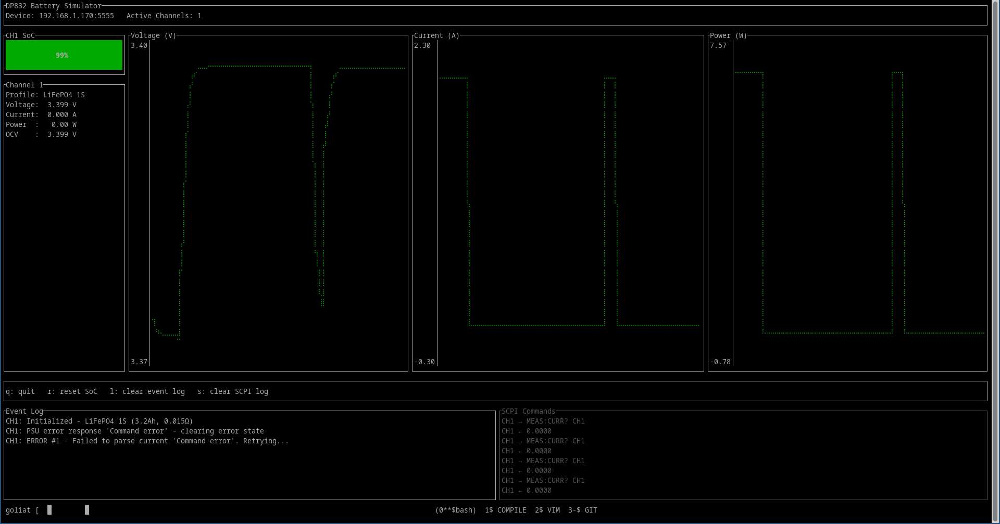
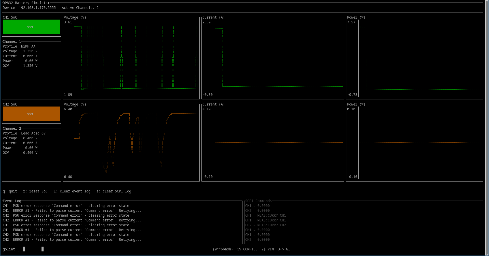
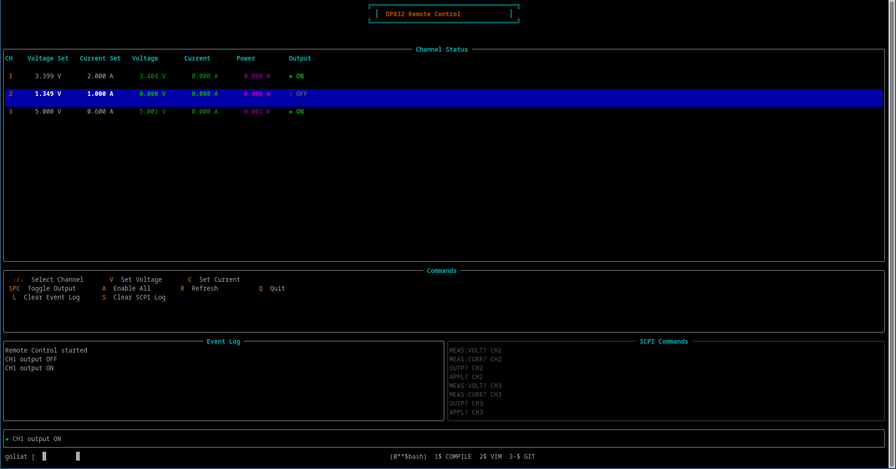

DP832 Multitool
===============

A comprehensive toolkit for the Rigol DP832 power supply unit, featuring:

1. **Battery Simulator**: Real-time battery simulation with advanced modeling
2. **Remote Control Interface**: Complete remote control of all PSU functions

Screenshots
-----------

Battery Simulator
~~~~~~~~~~~~~~~~~

*Battery simulator with single LiFePO4 channel showing real-time graphs, SoC gauge, and log windows*

*Three-channel battery simulation with different chemistry profiles running simultaneously*

Remote Control Interface
~~~~~~~~~~~~~~~~~~~~~~~~~

*Remote control interface showing all three channels with real-time monitoring and control*

.. note::
   Screenshots are located in the ``screenshots/`` directory. See `screenshots/README.rst <screenshots/README.rst>`_ for information on capturing and adding screenshots.

Tools
-----

Battery Simulator
~~~~~~~~~~~~~~~~~

A real-time battery simulator that simulates realistic battery behavior including voltage-current characteristics, state of charge (SoC), internal resistance, and discharge curves based on battery chemistry profiles.

Features
--------

Multi-Channel Support
~~~~~~~~~~~~~~~~~~~~~

- **3 independent channels**: Simulate up to 3 batteries simultaneously
- **Per-channel configuration**: Each channel can have different battery profiles
- **Split-view display**: Real-time monitoring of all active channels

Advanced Battery Modeling
~~~~~~~~~~~~~~~~~~~~~~~~~~

- **State of Charge (SoC) tracking**: Accurate coulomb counting
- **Internal resistance**: Realistic voltage drop under load
- **RC time constants**: Smooth voltage transitions
- **OCV curves**: Customizable open-circuit voltage vs. SoC characteristics
- **Cutoff protection**: Automatic shutdown at minimum voltage
- **Current limiting**: Configurable charge/discharge limits

Rich Terminal UI (TUI)
~~~~~~~~~~~~~~~~~~~~~~~

- **Real-time graphs**: Voltage, current, and power history for each channel
- **Live metrics**: SoC gauge, voltage, current, power, and OCV
- **Dual log windows**: 
  
  - Event log for runtime messages (also saved to ``logs/event_*.log``)
  - SCPI command log for debugging (also saved to ``logs/scpi_*.log``)

- **Auto-scrolling**: Latest information always visible
- **Keyboard controls**: Interactive management
- **Persistent logs**: All events and SCPI commands saved to timestamped files

Robust Communication
~~~~~~~~~~~~~~~~~~~~

- **Separate TCP connections**: One dedicated connection per channel to avoid interference
- **Proper initialization**: Each connection cleared with ``*CLS`` before use
- **Simple SCPI commands**: Standard commands without channel suffix (as per DP832 manual)
- **Channel selection persistence**: Select once at init, then use simple commands
- **Error detection & recovery**: Automatically detects and clears PSU error responses
- **Retry logic**: Gracefully handles transient communication errors
- **Error handling**: Stops simulation after 5 consecutive errors for safety
- **Detailed logging**: All SCPI commands and responses logged for debugging

Battery Chemistry Profiles
~~~~~~~~~~~~~~~~~~~~~~~~~~~

Pre-configured profiles for common battery types:

- **LiFePO4**: Lithium Iron Phosphate (3.2V nominal)
- **Li-ion 18650**: Standard lithium-ion cells
- **LiPo**: Lithium Polymer (1S configuration)
- **Lead-acid**: 6V lead-acid batteries
- **NiMH**: Nickel Metal Hydride (AA cell)

Installation
------------

Prerequisites
~~~~~~~~~~~~~

- Rust toolchain (1.70+)
- DP832 power supply on the network

Build from source
~~~~~~~~~~~~~~~~~

.. code-block:: bash

   git clone <repository-url>
   cd dp832-battery-sim
   cargo build --release

The binaries will be in:

- ``target/release/battery-sim`` - Battery simulator
- ``target/release/remote-control`` - Remote control interface

Quick Start
-----------

Battery Simulator
~~~~~~~~~~~~~~~~~

Single Channel Example
^^^^^^^^^^^^^^^^^^^^^^^

.. code-block:: bash

   battery-sim \
     --ip 192.168.1.100 \
     --port 5555 \
     -p profiles/lifepo4.json

Three Channel Example
^^^^^^^^^^^^^^^^^^^^^

.. code-block:: bash

   battery-sim \
     --ip 192.168.1.100 \
     --port 5555 \
     -p profiles/lifepo4.json \
     -p profiles/liion_18650.json \
     -p profiles/lipo_1s.json

Using Configuration File
^^^^^^^^^^^^^^^^^^^^^^^^

.. code-block:: bash

   battery-sim \
     --config examples/three_channels.toml \
     -p profiles/lifepo4.json \
     -p profiles/liion_18650.json \
     -p profiles/lipo_1s.json

Remote Control Interface
~~~~~~~~~~~~~~~~~~~~~~~~~

A complete remote control interface for the DP832 power supply with real-time monitoring and control of all channels.

Basic Usage
^^^^^^^^^^^

.. code-block:: bash

   remote-control --ip 192.168.1.100

With Configuration File
^^^^^^^^^^^^^^^^^^^^^^^

.. code-block:: bash

   remote-control --config config.toml

**Keyboard Controls:**

- **↑/↓**: Select channel
- **V**: Edit voltage setpoint
- **C**: Edit current setpoint  
- **SPACE**: Toggle output on/off for selected channel
- **A**: Enable all channels at once
- **R**: Refresh measurements
- **L**: Clear event log window
- **S**: Clear SCPI command log window
- **Q**: Quit

**The interface displays:**

- Real-time voltage and current measurements per channel
- Set values vs. actual values
- Power consumption per channel
- Output status (ON/OFF) with visual indicators
- Event log for runtime messages (also saved to ``logs/event_*.log``)
- SCPI command log for debugging (also saved to ``logs/scpi_*.log``)

**Features:**

- Visual table-based interface with color-coded status
- Selected channel highlighting
- Live editing of voltage and current values
- Persistent log files for troubleshooting
- Auto-scrolling log windows
- Efficient communication - only switches channels when necessary

Configuration
-------------

TOML Configuration File
~~~~~~~~~~~~~~~~~~~~~~~~

Configuration files support:

- Device IP and port settings
- Default battery profile
- CSV logging configuration

Example:

.. code-block:: toml

   [device]
   ip = "192.168.1.100"
   port = 5555

   [battery]
   profile = "profiles/lifepo4.json"

   [logging]
   csv = "logs/battery_test.csv"

Battery Profile JSON
~~~~~~~~~~~~~~~~~~~~

Each battery profile defines:

- **Chemistry parameters**: Capacity, internal resistance
- **Operating limits**: Current limits, voltage range
- **Dynamics**: RC time constant, update interval
- **OCV curve**: State of Charge vs. voltage mapping

Example profile structure:

.. code-block:: json

   {
     "name": "LiFePO4 3.2V",
     "channel": 1,
     "capacity_ah": 2.5,
     "internal_resistance_ohm": 0.02,
     "current_limit_discharge_a": 5.0,
     "current_limit_charge_a": 2.5,
     "cutoff_voltage": 2.5,
     "max_voltage": 3.65,
     "rc_time_constant_ms": 200,
     "update_interval_ms": 100,
     "ocv_curve": [
       { "soc": 1.00, "voltage": 3.40 },
       { "soc": 0.50, "voltage": 3.25 },
       { "soc": 0.00, "voltage": 2.50 }
     ]
   }

See ``profiles/`` directory for complete examples.

UI Controls
-----------

While the simulator is running:

- **q**: Quit the simulator
- **r**: Reset SoC to 100% for all channels
- **l**: Clear event log window
- **s**: Clear SCPI command log window

Logging
-------

Persistent Log Files
~~~~~~~~~~~~~~~~~~~~

All runtime events and SCPI commands are automatically saved to timestamped log files in the ``logs/`` directory:

- **Event Log**: ``logs/event_YYYYMMDD_HHMMSS.log``
  
  - Runtime messages and errors
  - Channel initialization
  - Current measurements
  - Cutoff voltage events
  
- **SCPI Command Log**: ``logs/scpi_YYYYMMDD_HHMMSS.log``
  
  - All commands sent to the power supply (marked with →)
  - All responses received (marked with ←)
  - Useful for debugging communication issues

Each log entry includes a precise timestamp (YYYY-MM-DD HH:MM:SS.mmm). Log files persist after the application exits for analysis and troubleshooting.

CSV Logging
~~~~~~~~~~~

Enable CSV logging with ``--log`` or in the configuration file:

.. code-block:: bash

   dp832_battery_sim --log battery_test.csv -p profiles/lifepo4.json

For multiple channels, separate CSV files are created automatically:

- ``battery_test_ch1.csv``
- ``battery_test_ch2.csv``
- ``battery_test_ch3.csv``

CSV columns:

- Time (seconds)
- State of Charge (0-1)
- Voltage (V)
- Current (A)
- Power (W)

SCPI Command Logging
~~~~~~~~~~~~~~~~~~~~

All SCPI commands are logged in the bottom-right log window and to ``logs/scpi_*.log`` files. Set ``VERBOSE_SCPI`` environment variable for detailed logging:

.. code-block:: bash

   VERBOSE_SCPI=1 dp832_battery_sim -p profiles/lifepo4.json

Examples
--------

The ``examples/`` directory contains ready-to-use configuration files:

- **single_channel.toml**: Basic single-channel setup
- **three_channels.toml**: All three channels active
- **chemistry_comparison.toml**: Compare different battery types
- **development.toml**: Development and testing
- **bench.toml**: Quick bench testing

See `examples/README.rst <examples/README.rst>`_ for detailed usage.

Battery Profiles
----------------

The ``profiles/`` directory contains pre-configured battery profiles:

- **lifepo4.json**: LiFePO4 3.2V 2.5Ah
- **lifepo4_3s.json**: 3S LiFePO4 pack (9.6V)
- **liion_18650.json**: Standard 18650 cell (3.7V)
- **lipo_1s.json**: 1S LiPo cell (3.7V)
- **lead_acid_6v.json**: 6V lead-acid battery
- **nimh_aa.json**: NiMH AA cell (1.2V)

See `profiles/README.rst <profiles/README.rst>`_ for details on each profile and how to create custom profiles.

Architecture
------------

Project Structure
~~~~~~~~~~~~~~~~~

.. code-block:: text

   dp832-battery-sim/
   ├── src/
   │   ├── main.rs          # Core simulation logic, SCPI communication
   │   └── ui.rs            # Terminal UI with ratatui
   ├── profiles/            # Battery chemistry profiles
   ├── examples/            # Example configuration files
   ├── logs/                # CSV output files
   └── Cargo.toml           # Rust dependencies

Key Components
~~~~~~~~~~~~~~

1. **SCPI Connection Layer**
   
   - TCP stream management
   - Channel selection optimization
   - Adaptive timeouts for different command types
   - Buffer draining to prevent response bleed

2. **Battery Model**
   
   - OCV interpolation from SoC
   - Internal resistance voltage drop
   - RC time constant smoothing
   - Coulomb counting for SoC

3. **UI Layer**
   
   - Real-time graphing with 200-point history
   - Multi-channel split view
   - Dual logging windows
   - Responsive layout

4. **Simulation Engine**
   
   - Per-channel threads
   - Shared state management
   - CSV export
   - Safety cutoffs

Troubleshooting
---------------

"Command error" from PSU
~~~~~~~~~~~~~~~~~~~~~~~~

The simulator implements adaptive timeouts and buffer draining to handle this. If you still see these errors:

- Ensure good network connection to PSU
- Check that no other software is controlling the PSU
- Try power cycling the PSU

Current reading shows "Command error"
~~~~~~~~~~~~~~~~~~~~~~~~~~~~~~~~~~~~~

The simulator will automatically stop the channel and log the error. This is a safety feature. Check:

- PSU response to ``MEAS:CURR?`` command
- Network stability
- PSU firmware version

TUI display garbled
~~~~~~~~~~~~~~~~~~~

The TUI requires a terminal with good ANSI support. Recommended terminals:

- Linux: gnome-terminal, konsole, xterm
- macOS: iTerm2, Terminal.app
- Windows: Windows Terminal

Enable verbose SCPI logging
~~~~~~~~~~~~~~~~~~~~~~~~~~~~

For detailed debugging of SCPI communication:

.. code-block:: bash

   VERBOSE_SCPI=1 dp832_battery_sim -p profiles/lifepo4.json

Development
-----------

Building
~~~~~~~~

.. code-block:: bash

   cargo build

Running tests
~~~~~~~~~~~~~

.. code-block:: bash

   cargo test

Running with logging
~~~~~~~~~~~~~~~~~~~~

.. code-block:: bash

   RUST_LOG=debug cargo run -- -p profiles/lifepo4.json

Contributing
------------

Contributions welcome! Areas of interest:

- Additional battery chemistry profiles
- More sophisticated battery models (thermal effects, aging)
- Remote monitoring/control interface
- Additional power supply models

License
-------

[Your license here]

Acknowledgments
---------------

- Uses `ratatui <https://github.com/ratatui-org/ratatui>`_ for the terminal UI
- Targets Rigol DP832 triple-output power supply
